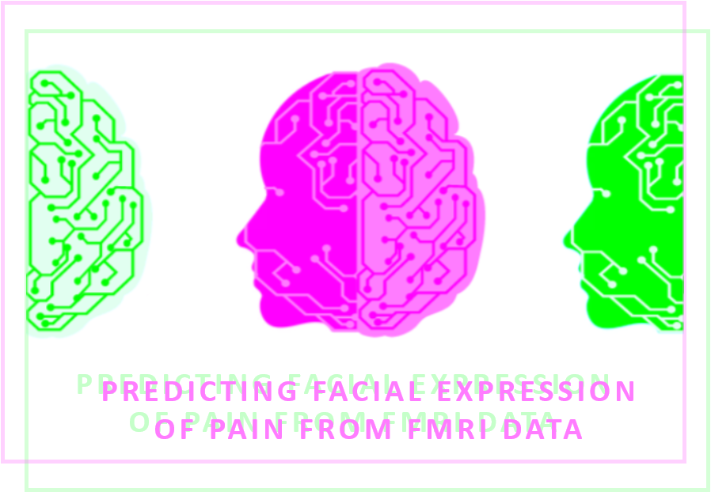

# Predicting facial expression of pain in healthy adults from fMRI data

## Summary

Education:
* B.Sc. in cognitive neuroscience
* Currently a Master's student in Psychology at Université de Montréal

I am interested in the neural correlates of pain and the communication of pain. The goal of my master project is to predict the occurrence and intensity of the facial expression of pain from brain activity (fMRI data) in response to a tonic painful stimuli. 

I'm also interested in the different methods used to analyze neuroimaging data.

# Project definition

## Background

Facial expression of pain is an important non-verbal informative element of communication, signaling an immediate threat and a need for help. Facial movements related to the experience of pain are associated not only with the sensory dimension of pain (i.e., pain intensity) but also with its affective dimension (i.e., the unpleasantness of pain). The facial expression can be measured with the Facial Action Coding System (FACS, Ekman & Friesen, 1978), which is based on the possible action of muscles or groups of muscles, called action units. We can compute a composite score (FACS score) taking into account the frequency and the intensity of the contraction of these action units. 

   
**Personal goals**
* Apply machine learning to neuroimaging data :heavy_check_mark:
* Learn visualization tools :heavy_check_mark:
* Improve my coding skills :heavy_check_mark:
* Learn how to run analysis on compute canada and don't be afraid of it :heavy_check_mark:

## Tools

The completion of this project will require the following tool: 
* **Python scripts** to write the code for the analysis
* Several python modules: 
   * Pandas: to manipulate the behavioral dataframe
   * Numpy: to manipulate arrays
   * Nibabel: to load the fMRI contrast images (from .hdr files to Nifti objects)
   * Scikit-learn: for machine learning stuff
   * Nilearn: to extract and to visualize the fMRI data
   * Matplotlib, seaborn, plotly: to plot some figures
* The analysis will be run on **compute canada**
* The python scripts and figures will be added to the **github** repository 

## Data

The dataset that will be used for this project is a secondary private dataset (not open access yet). It includes 55 participants (women = 28, men = 27) aged between 18 and 53 years old. Moderately painful stimuli were applied while they where in the MRI scanner. Their facial expression was recorded during this time by the use of a MRI-compatible camera. Each participant completed 2 runs of 8 painful trials, resulting to 797 observations (after removing data with movement artefacs). 

*Illustration of the experimental paradigme.*

## Deliverables

By the end of this course, I will provide 
* python scripts for:
   - [X] Prepping the dataset for the analysis
   - [X] Machine learning pipeline
* jupyter notebook for:
   - [X] Visualizing the results
* Static and interactive visualizations of the results
* MarkDown README.md documenting all important information about the project
* Github repository containing the scripts, graphs, report and relevant information

# Results

## Overview

### Deliverables

**Python scripts**
  Four python scripts can be found in the [scripts folder](https://github.com/PSY6983-2021/picard_project/tree/main/scripts):
* [main.py](https://github.com/PSY6983-2021/picard_project/blob/main/scripts/main.py) : main script calling functions in prepping_data.py and building_model.py. This script also includes code to save the train and test sets (in numpy format), the coefficients of the regression model (in nii.gz format), the model (in pickle format), the output of the permutation test (in json format) and the bootstrap test (in pickle format).
* [data_to_json.py](https://github.com/PSY6983-2021/picard_project/blob/main/scripts/data_to_json.py) : script to save the fmri data (predictive variable), the target variable (predicted variable) and the group variable (for non iid data: multiple observations per participant, optional) in json format.
* [prepping_data.py](https://github.com/PSY6983-2021/picard_project/blob/main/scripts/prepping_data.py) : script to load data in Nifti-like format and to extract the signal according to a nilearn pre-defined mask or to a pre-computed mask.
* [building_model.py](https://github.com/PSY6983-2021/picard_project/blob/main/scripts/building_model.py) : script to compute the regression model, the permutation test and the bootstrap test. 

The requirements to run the python scripts can also found in the [scripts folder](https://github.com/PSY6983-2021/picard_project/tree/main/scripts) in the [requirements.txt](https://github.com/PSY6983-2021/picard_project/blob/main/scripts/requirements.txt) file. See also the [scripts_instruction.txt](https://github.com/PSY6983-2021/picard_project/blob/main/scripts/scripts_instruction.txt) for more details.

**Jupyter notebook**
  The jupyter notebook containing the script to generate the figures can be found in the [notebook folder](https://github.com/PSY6983-2021/picard_project/tree/main/notebook).

**Visualization of the results**
  The png/html format of the figures generated in this project can be found in the [images/output subfolder](https://github.com/PSY6983-2021/picard_project/tree/main/images/output).

## Regression models

## Classifier model

A SVM classifier was run to see if it is possible to predict which dataset the fMRI data came from. The classifier was able to predict the dataset with an accuracy of 84.2 ± 1.6 %. 

*Confusion matrices across the 5-fold cross-validation.* 

This result possibly highlights that the fMRI data in the two datasets come from different distributions. This might be due the different parameters used to acquire the fMRI data. The only divergent acquisition parameters were the number of whole-brain volumes acquired during each functional scan (170 volumes vs 160 volumes) and the voxel sizes (3.44 x 3.44 x 3.40 mm vs 3.4 x 3.4 x 3.4 mm). The averaged age of the participants was also different between the datasets (23.4 ± 2.5 years vs 36.0 ± 10.9 years). This age difference may have contributed to the high classification accuracy, although there is no clear evidence to support a difference in brain activity related to facial expression of pain according to different age groups in the litterature. 

## Conclusion

## Acknowledgement

## References

Ekman, P. et Friesen, W. V. (1978). Facial action coding systems. Consulting Psychologists Press.

Kunz, M., Chen, J.-I., Lautenbacher, S., Vachon-Presseau, E. et Rainville, P. (2011). Cerebral regulation of facial expressions of pain. Journal of Neuroscience, 31(24), 8730-8738. https://doi.org/10.1523/JNEUROSCI.0217-11.2011

Vachon-Presseau, E., Roy, M., Woo, C.-W., Kunz, M., Martel, M.-O., Sullivan, M. J., Jackson, P. L., Wager, T. D. et Rainville, P. (2016). Multiple faces of pain: effects of chronic pain on the brain regulation of facial expression. Pain, 157(8), 1819-1830. https://doi.org/10.1097/j.pain.0000000000000587
